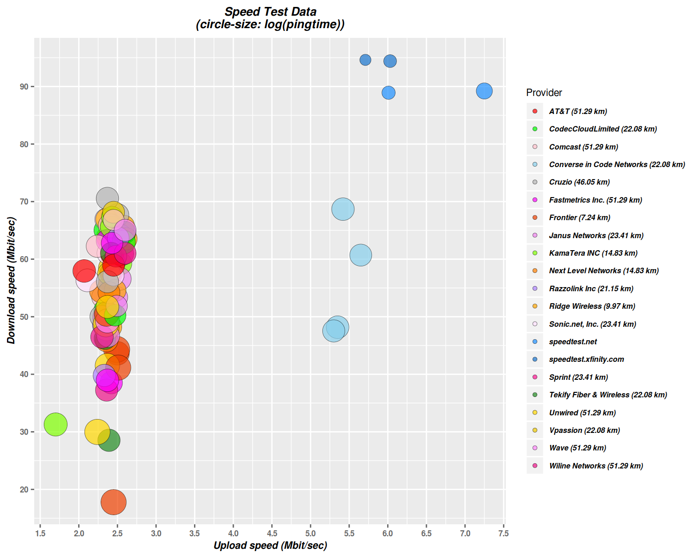

# Internet speed data

This repository [github.com://arielf/speedtests](https://github.com/arielf/speedtests) contains data about internet speeds. 

- To generate a scatter-plot (example below) from the `speedtests.tsv` file , use the `speedtests.R` script.
- `speedtests.R` depends on `R` + the `data.table` & `ggplot2` libraries 
- To obtain a data-set, you'll need the prereq Ubuntu command-line `speedtest` utility.
- See `Makefile` for the full flow.

## Summary

Comcast claims my plan should give me dowload bandwitdh of 75 Mbps (Mega-bits per second).

They don't say anything about upload-speeds or ping round-trip latencies, which is a shame.

When testing my speed using Comcast own speed-test service, the results say I'm getting the promised speed and then some.

Here's an example of a screenshot from a test by Ookla (aka speedtest.net, owned by Comcast) where all numbers look good and as I expect them:

 

However whenever I test my speeds against multiple & independent speed-test providers, my results are significantly and consistently worse.

How much worse?

- Average download speeds are roughly 2x worse
- Average upload speeds are roughly 2x worse
- Average ping round-trips are roughly 3x to 6x times worse

The data below, collected over different times, using various services, speaks for itself. The explanation is left for the reader.

[Raw speed-test data (TSV format)](speedtests.tsv)

## Notes:

- The darker blue points at the top-right quarter of the chart are Comcast data-points. The very top ones correspond to _speedtest.xfinity.com_, the slightly lower ones, correspond to _speedtest.net_ (Ookla, owned by Comcast).
- All independent internet speed-test providers, except one (Converse in Code) fall to the left of the center (<5.0 Mbps upload speeds) and none come close to the _speedtest.xfinity.com_ result in either speeds or latencies.
- Interestingly, there is one additional Comcast data center (52 km away) which is not my default speedtest target, which seems to be throttled-down like the other independent providers. Is it too complex for Comcast engineers to deny "net neutrality" once a routing boundary not in their control is crossed?
- Seems like Comcast is selective about which peering points or sources it is throttling-down. The default speed-test I get in the browser is not throttled-down and makes Comcast apppear as if it is the fastest of all providers.
- In the past, I used to see consistent speeds between Comcast speedtest sites and other independent speedtest site in the Bay Area. I was seeing ~90Mbps down and 5.5MBps up pretty consistently, regardless of which speed-test service I used.

## Bottom line

_In reality, the speed claimed by Comcast is *not representative of real average speeds* I experience._

_The service levels are *significantly worse* than advertised, when accessing most or even all parts of the internet (other than Comcast dedicated & misleading speedtest sites)_

## References:

- [A similar experience by another Comcast subscriber on xfinity forums](https://forums.xfinity.com/t5/Your-Home-Network/Proof-Comcast-Throttling-Internet-Speeds/td-p/3056103)
- [My own recent experience dealing with Comcast](Comcast.md)

